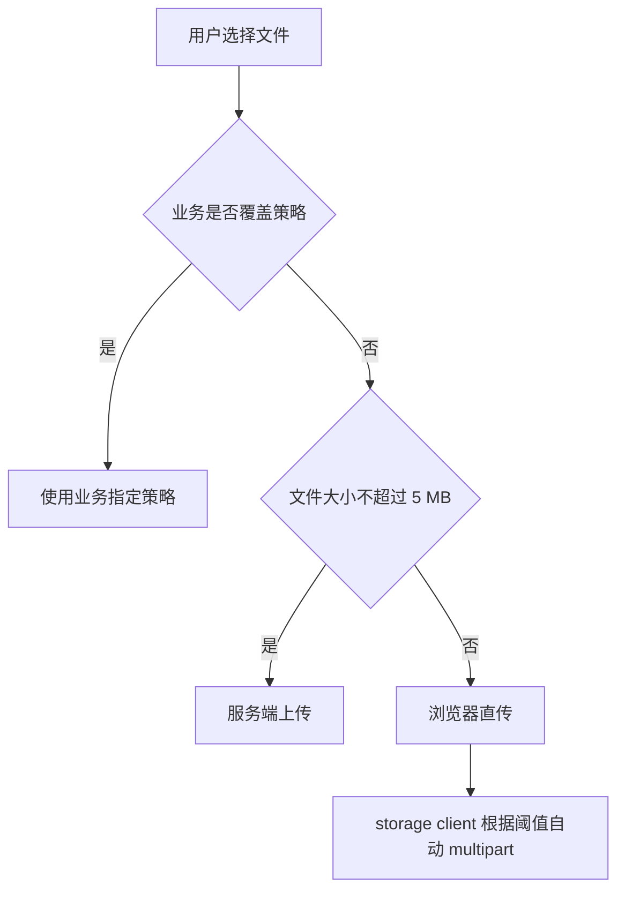
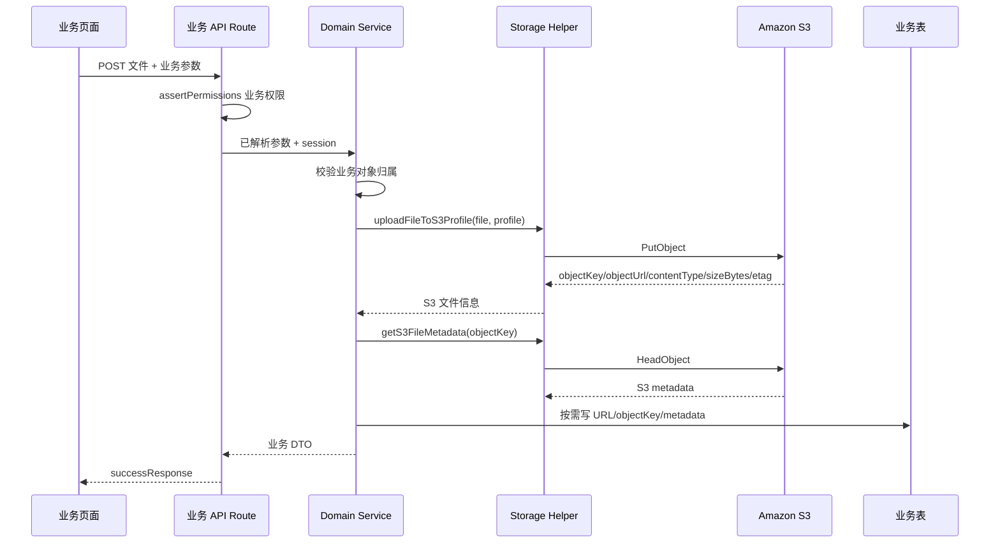
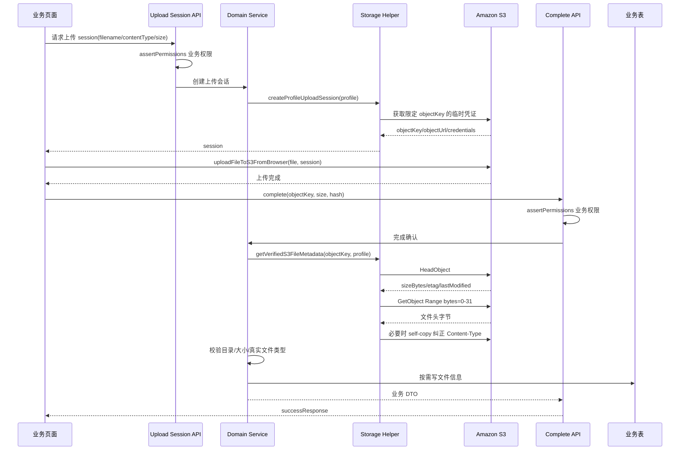
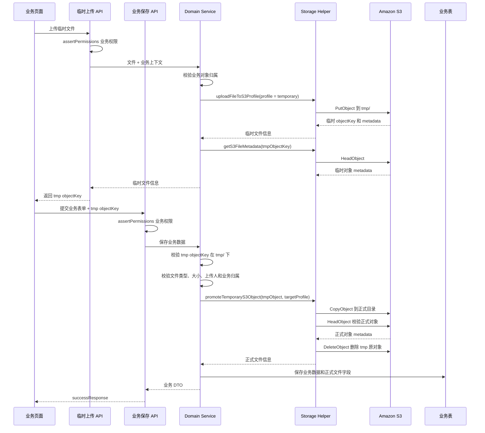
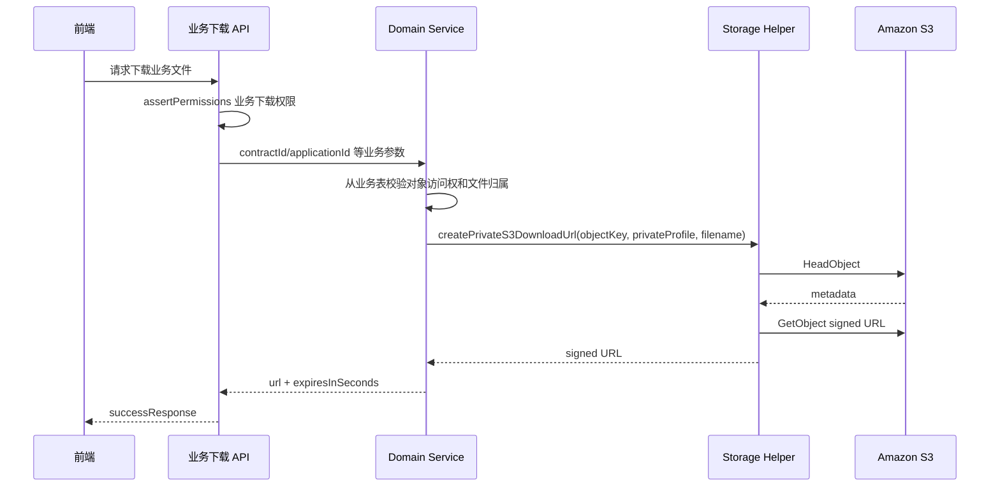

# S3 文件上传与访问规范（AGENT 版）

本文是 AGENT 接入 S3 上传、访问、直传确认和业务绑定时的单一执行入口。硬边界以 `.claude/docs/storage-s3.md` 为准；写接口前同时读 `.claude/docs/api-and-requests.md`，接权限前读 `.claude/docs/auth-permissions.md`。

## 0. 先记住

- S3 能力统一走 `@cloud/storage/server`、`@cloud/storage/client` 或 app 侧 storage helper，业务代码不要直接 new AWS SDK。
- 配置由 app 侧读取并显式传入 storage package，`packages/storage` 不读 `.env`。
- admin 应用侧只读取 `AWS_S3_BUCKET`、`AWS_REGION`、`AWS_ACCESS_KEY_ID`、`AWS_SECRET_ACCESS_KEY`、`AWS_S3_MAX_SIZE_BYTES`、`AWS_S3_MULTIPART_THRESHOLD_BYTES`、`AWS_S3_MULTIPART_PART_SIZE_BYTES`。
- 前端不决定 S3 目录，不传任意 `directory`。
- 正式业务接口由后端固定或推导 `uploadProfile`。
- 项目不提供统一文件本体表，也不提供通用 `/api/storage/*` 生产入口。
- S3 返回的文件信息由各业务表按需保存；可以只存一个 URL，也可以存完整对象信息。
- mutation 走 Route Handler，不用 Server Action。
- route 只做 HTTP 适配；权限、业务范围、绑定策略放 service / policy。
- 业务错误抛 `BusinessError` / `MiddlewareError`，成功响应走 `successResponse()` / `createdResponse()` / `noContentResponse()`。
- 公开文件只允许真实图片，必须校验 PNG/JPEG/GIF/WebP/AVIF 等文件头签名，不能只信客户端传入的 `ContentType`；object key 必须在 `public/` 下，浏览器直传完成时还要把 S3 对象 `Content-Type` 纠正为真实图片类型。
- 私有文件不要返回固定 URL；下载前先校验业务权限和业务对象归属，再用后端固定或推导的 PRIVATE profile 生成短期 signed URL。
- 直传完成必须 `HeadObject` 成功后才写业务表；不要信任前端传来的最终 metadata。

## 1. 现有实现位置

| 文件 | 作用 |
| --- | --- |
| `packages/storage/src/server/*` | S3 服务端能力：配置归一化、STS 临时凭证、服务端上传、HeadObject、CopyObject、DeleteObject、signed URL |
| `packages/storage/src/client/*` | 浏览器直传能力：PUT、multipart、进度、取消 |
| `apps/admin/lib/s3-upload-config.ts` | app 侧读取 S3 环境变量并传入 `@cloud/storage/server` |
| `apps/admin/lib/s3-upload-policy.ts` | 上传大小策略 |
| `apps/admin/lib/s3-upload-profiles.ts` | upload profile 到目录和可见性的映射 |
| `apps/admin/lib/storage-files.ts` | app 侧 S3 helper：按 profile 创建上传会话、服务端上传、转正、metadata、signed URL |
| `apps/admin/lib/storage-types.ts` | S3 helper 对外返回的文件信息类型 |
| `apps/admin/lib/storage-visibility.ts` | profile 访问属性校验：PUBLIC 必须是 `image/*` 且在 `public/` 下 |

新增业务能力优先落 `apps/<app>/service/<domain>/`。业务 route 做权限和 HTTP 适配，domain service 调 storage helper，并决定业务表保存哪些字段。

## 2. S3 能返回什么

`@cloud/storage/server` 和 `apps/admin/lib/storage-files.ts` 可返回这些信息。业务开发人员按业务需要挑选字段落表。

| 字段 | 来源 | 含义 |
| --- | --- | --- |
| `bucket` | 上传 / HeadObject / CopyObject | S3 bucket |
| `regionId` | 配置 | AWS region |
| `uploadUrl` | 配置 | S3 endpoint 或 CDN/custom host |
| `objectKey` | 上传 / session / copy / metadata | S3 对象 key，是私有下载、复制、删除的核心定位字段 |
| `objectUrl` | helper 推导 | 稳定对象 URL；公开文件可直接访问，私有文件不能当下载授权 |
| `contentType` | 上传输入、HeadObject 或文件头识别 | MIME 类型；PUBLIC 文件以服务端识别的真实图片类型为准 |
| `sizeBytes` | 上传输入 / HeadObject | 文件字节数；HeadObject 的 `ContentLength` 最可信 |
| `etag` | S3 响应 | S3 ETag；multipart 时不等同内容 MD5 |
| `lastModified` | HeadObject | S3 最后修改时间 |
| `credentials` | 上传 session | 浏览器直传用临时凭证，只返回给前端使用，不写业务表 |

业务侧可额外保存不属于 S3 的信息，例如 `originalFilename`、`contentHash`、`uploadedBy`、`uploadedAt`、`visibility`、排序号、业务用途等。

## 3. uploadProfile

`uploadProfile` 是后端给文件用途起的业务名字，它决定 S3 目录和可见性。正式业务接口应该由后端固定或根据业务对象推导，前端不要直接传 profile 决定文件用途。

普通业务接口不要暴露 `existingObjectKey`。它是“复用或指定目标 S3 key”的底层可选能力，只允许在后端已确认业务对象、旧文件归属和替换语义后使用；一旦使用，必须校验该 key 落在当前 profile 目录内。

当前 profile：

| uploadProfile | directory | visibility | 用途 |
| --- | --- | --- | --- |
| `debug.private` | `debug` | `PRIVATE` | 调试私有文件 |
| `temporary` | `tmp` | `PRIVATE` | 表单未保存前的临时文件 |
| `application.icon` | `public/applications/icons` | `PUBLIC` | 应用图标 |
| `application.image` | `public/applications/images` | `PUBLIC` | 应用展示图 |
| `application.package` | `applications/packages` | `PRIVATE` | 应用安装包 |

新增 profile 时：

1. 先确认文件用途：公开展示、私有下载、还是临时草稿。
2. 在业务 service / profile 映射里定义稳定枚举，不让前端传任意目录。
3. 公开资源目录必须是 `public` 或 `public/...`，并校验 `image/*`。
4. 私有资源不要放进 `public/`。
5. 临时目录使用 `tmp` 或 `tmp/...`，不要写 `/tmp`；S3 没有真正根目录，前导 `/` 会成为 key 的一部分。
6. 多租户或多业务对象共享同一 profile 时，优先在业务 profile / service 生成包含 party、tenant 或业务对象 id 的目录段；否则必须依赖随机 objectKey 和业务表归属校验避免跨对象覆盖。

推荐目录：

| 场景 | 目录 |
| --- | --- |
| 应用图标 | `public/applications/icons` |
| 应用展示图 | `public/applications/images` |
| 用户头像 | `public/users/avatars` |
| 应用安装包 | `applications/packages` |
| 合同文件 | `contracts/files` |
| 临时文件 | `tmp` |

## 4. 业务表怎么存

项目不统一规定业务表字段。业务可以按自己的读取、展示、下载、审计和清理需求选择字段。

最小公开图场景可以只存：

```txt
icon_url
```

私有下载至少建议保存：

```txt
object_key
original_filename
content_type
```

需要校验、展示、去重或审计时，建议保存完整对象：

```json
{
  "bucket": "cloud-scaffold-uploads",
  "regionId": "ap-southeast-1",
  "objectKey": "public/applications/icons/20260615-icon.png",
  "objectUrl": "https://cdn.example.com/public/applications/icons/20260615-icon.png",
  "contentType": "image/png",
  "sizeBytes": 12345,
  "etag": "\"etag\"",
  "lastModified": "2026-06-15T01:23:45.000Z",
  "originalFilename": "icon.png",
  "contentHash": "sha256-hex-if-business-needs-it",
  "visibility": "PUBLIC"
}
```

多文件建议用业务表 JSONB 数组保存对象快照；数组顺序就是展示顺序。是否拆字段、是否加索引、是否保存 hash，都由业务域根据查询需求决定。

## 5. 上传流程

默认策略由框架 helper 根据文件大小选择，业务有特殊处理需求时可以覆盖。

策略选择：



小文件服务端上传：

1. 业务 route 做明确业务权限守卫，例如 `applications.UPDATE` / `contracts.UPLOAD`。
2. route 解析 `FormData`，只接收文件和业务对象参数。
3. domain service 固定或推导 `uploadProfile`。
4. 调 `uploadFileToS3Profile()` 或 `uploadFileToS3FromServer()` 上传。
5. 如需更可信 metadata，调 `getS3FileMetadata()` / `getS3ObjectMetadata()` 做 HeadObject。
6. service 根据业务规则写业务表字段。

服务端上传：



大文件浏览器直传：

1. 客户端先用 `crypto.subtle.digest("SHA-256", ...)` 计算文件 hash（业务需要时）。
2. 业务 route 做明确业务权限守卫，创建上传 session。
3. service 固定 profile，调用 `createProfileUploadSession()`。
4. 浏览器调用 `uploadFileToS3FromBrowser({ file, session })` 上传到 S3。
5. 上传完成后调用业务域 complete 接口。
6. complete 接口必须 `HeadObject`，以 S3 返回的 `sizeBytes`、`etag` 为准；PUBLIC 文件还必须读取对象前几个字节校验真实图片签名，不能只信 `ContentType`。
7. PUBLIC 文件如果真实图片类型和 S3 `HeadObject.ContentType` 不一致，helper 必须通过 S3 self-copy 改写对象 `Content-Type`，避免公开 URL 返回错误 MIME。
8. service 根据业务规则写业务表字段。

浏览器直传：



## 6. 临时文件与转正

表单类页面可以先传临时文件到 `tmp`。用户没有点击保存时，文件留在 `tmp`，后续由清理任务或业务流程删除；用户保存成功后，再复制成正式文件。

临时文件规则：

- 目录使用 `tmp` 或 `tmp/...`。
- 业务表不能把临时文件当正式资源。
- 如果业务需要跟踪草稿文件，草稿字段由业务表自己保存。

转正流程：

1. 业务 service 从业务上下文或请求中取得临时对象信息，至少需要 `objectKey`、`contentType`，最好有 `sizeBytes` 和 `originalFilename`。
2. 校验临时 `objectKey` 必须在 `tmp/` 下，并校验文件类型、大小、上传人、业务权限。
3. 根据业务接口选择正式 profile，例如应用图标使用 `application.icon -> public/applications/icons -> PUBLIC`。
4. 后端必须生成新的随机正式 `objectKey`，不要把 `tmp/...` 的最后一段直接拼到正式目录；`originalFilename` 只能参与显示或作为 sanitize 后的尾部提示。
5. S3 没有 rename，转正必须 `CopyObject` 到正式目录下的新 `objectKey`；`CopyObject` 默认不覆盖已有对象。
6. `HeadObject` 校验正式对象后，业务 service 保存需要的文件信息到业务表。
7. 删除原 `tmp/...` 对象；如果删除失败，交给清理任务重试。

临时文件完整时序：



## 7. 已封装函数

业务开发优先使用 `apps/admin/lib/storage-files.ts` 里的封装函数，不直接操作 S3 SDK。

| 函数 | 用途 | 业务需要关心 |
| --- | --- | --- |
| `createProfileUploadSession` | 按后端 profile 创建浏览器直传 session | 先做业务权限校验；`credentials` 只给前端上传，不写业务表；普通业务不要暴露 `existingObjectKey` |
| `uploadFileToS3Profile` | 按后端 profile 由服务端上传文件 | 返回 S3 对象信息，业务自己决定落哪些字段；普通业务不要暴露 `existingObjectKey` |
| `getS3FileMetadata` | HeadObject 获取 S3 metadata | 私有文件下载前可调用；PUBLIC 文件不要只靠它判断真实类型 |
| `getVerifiedS3FileMetadata` | HeadObject + profile 目录校验 + PUBLIC 图片文件头校验 + 必要时纠正 S3 `Content-Type` | 浏览器直传 complete 写业务表前优先调用 |
| `promoteTemporaryS3Object` | 复制 tmp 文件到正式 profile 并删除 tmp 原对象 | 传临时对象信息；图片场景传 `requireContentTypePrefix: "image/"`；正式 key 由后端随机生成 |
| `createPrivateS3DownloadUrl` | 私有文件下载前校验 PRIVATE profile 目录、HeadObject 并生成短期 signed URL | 调用前必须完成业务权限和业务对象归属校验；profile 由后端固定或推导，不让前端决定 |

这些函数只处理存储能力，不替业务决定权限码、业务表字段、数组排序、DTO 字段名或清理策略。

## 8. 私有下载

私有文件不能把 `objectUrl` 直接返回给前端读取。

storage helper 只能确认 `objectKey` 落在指定 PRIVATE profile 目录、S3 对象存在，并生成短期 signed URL；它不知道业务对象、租户、组织或文件归属。当前用户是否能访问业务对象、文件是否属于该业务对象，必须由具体业务 service 根据业务表确认。

规则：

1. Route 做明确业务下载权限守卫。
2. Service 校验当前用户是否能访问该业务对象。
3. Service 从业务表读取该业务对象绑定的文件信息，至少取得 `objectKey`，可选取得 `originalFilename`；不要接收前端传入的任意 `objectKey` 作为下载目标。
4. 后端固定或推导该业务文件的 PRIVATE profile，调 `createPrivateS3DownloadUrl()` 生成短期 GET 签名链接。
5. 响应只返回 `{ url, expiresInSeconds }` 或业务约定 DTO，不要把 signed URL 持久化到数据库或日志。

默认有效期 300 秒；`@cloud/storage` 会把有效期限制在 60 到 3600 秒之间。

私有下载：



## 9. 权限

项目不提供通用 `/api/storage/*` 生产入口；上传、替换、删除、下载授权归属到实际业务域。不要新增通用 `storage.*` 业务权限码，也不要把 storage helper 包成登录即可调用的 API。

示例：

| 场景 | 权限示例 |
| --- | --- |
| 上传应用图标或展示图 | `APPLICATION.UPLOAD` |
| 替换图标或调整图片排序 | `APPLICATION.UPDATE` |
| 查看应用公开资源 | `APPLICATION.VIEW` |
| 上传合同文件 | `CONTRACT.UPLOAD` |
| 下载合同文件 | `CONTRACT.DOWNLOAD` |

前端按钮显隐只是体验层，route 必须使用 `assertPermissions()` 做服务端守卫。页面如果有明确权限要求，使用 `requirePermissions()`；如果只是登录后可见页，至少使用 `requireSession()`。

## 10. AWS 权限与环境

应用使用的 AWS 身份或被 assume 的 role 至少需要：

- 上传：目标 prefix 的 `s3:PutObject`
- multipart：`s3:AbortMultipartUpload`、`s3:CreateMultipartUpload`、`s3:UploadPart`、`s3:CompleteMultipartUpload`、`s3:ListMultipartUploadParts`
- 私有下载和下载前校验：`s3:GetObject`
- 临时转正：源对象 `s3:GetObject` + 目标对象 `s3:PutObject`
- 删除 tmp：`s3:DeleteObject`

浏览器直传 session 使用 STS `GetFederationToken` 生成临时凭证；session policy 只能收窄权限，不能放大应用 AWS 身份原本没有的权限。

公开读取的 bucket policy 只开放 `public/*`：

```json
{
  "Effect": "Allow",
  "Principal": "*",
  "Action": "s3:GetObject",
  "Resource": "arn:aws:s3:::your-bucket/public/*"
}
```

不要开放整个 bucket。

## 11. 业务接入清单

1. 明确业务对象和文件用途，决定业务表要存哪些文件字段。
2. 定义业务 upload profile 和 S3 目录；公开资源目录必须在 `public/` 下，私有资源不要放在 `public/` 下。
3. 判断页面权限：登录即可还是需要明确权限。
4. 在 manifest 和角色里补齐权限码。
5. 新增 domain service：封装上传完成后的业务绑定、范围校验、资源列表。
6. 新增 API route：只做权限、参数、响应适配。
7. 客户端按大小选择服务端上传或直传；正式业务调用业务接口只传文件和业务对象参数，不传任意 `directory` 或 `uploadProfile`。
8. 业务 service 用 HeadObject 确认 S3 metadata 后写业务表。
9. 公开文件由业务 DTO 自己决定返回字段名，例如 `iconUrl`、`imageUrl`、`logoUrl`。
10. 私有文件通过业务接口换 signed URL；下载时 service 必须从业务表确认文件归属，不让前端直接提交 `objectKey` 换签名。

## 12. 禁止事项

- 不在业务代码里直接 new AWS SDK。
- 不让前端传任意 `directory`。
- 正式业务接口不让前端决定 profile。
- 不把私有文件放到 `public/` 下。
- 不把非图片做成 `PUBLIC`。
- 不把临时文件绑定为正式业务资源。
- 不把 `tmp/...` 的最后一段直接作为正式 objectKey。
- 不让普通业务接口或前端传 `existingObjectKey`；确需使用时必须后端推导并校验当前 profile 目录。
- 不允许 `CopyObject` 默认静默覆盖已有对象；覆盖必须是显式业务语义并有额外权限和归属校验。
- 不新增统一文件本体表或通用文件归属表。
- 不把 signed URL 存入数据库或日志。
- 不用裸 `objectKey` 为私有文件签名；必须带后端固定或推导的 PRIVATE profile，并校验 key 落在该 profile 目录。
- 不在 `HeadObject` 失败时 fallback 到前端 metadata。
- 不把 `HeadObject.ContentType` 当作 PUBLIC 文件的真实类型；PUBLIC 文件必须校验文件头签名，并在不一致时改写 S3 对象 `Content-Type`。
- 不把“菜单能看到”当作安全边界。
- 不长期保留 `assertPermissions({ all: [] })` 这类空权限守卫。

## 13. 排障清单

- `storage.s3_env_missing`：检查 `AWS_S3_BUCKET`、`AWS_REGION`。
- `storage.s3_env_invalid`：检查大小、阈值、STS 时长是否为正整数，multipart part size 是否至少 5 MB。
- `storage.aws_credentials_invalid`：检查 AWS 凭证、STS role、session token。
- `storage.s3_access_denied`：检查 IAM policy、assume role policy、目标 prefix、`s3:GetObject` / `s3:PutObject` / `s3:DeleteObject`。
- `storage.s3_bucket_invalid`：检查 bucket 名称和 region 是否匹配。
- `storage.s3_endpoint_unreachable`：检查 endpoint、代理、网络和 DNS。
- 上传完成后下载 404：检查业务表保存的 `objectKey` 是否正确，以及业务下载接口是否用 HeadObject 校验。
- 公开图片无法访问：检查对象 key 是否在 `public/` 下，以及 bucket policy 是否只读开放 `public/*`。
