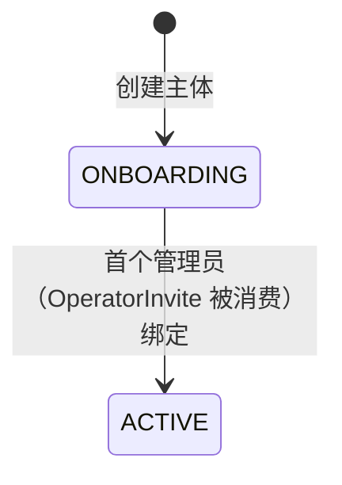
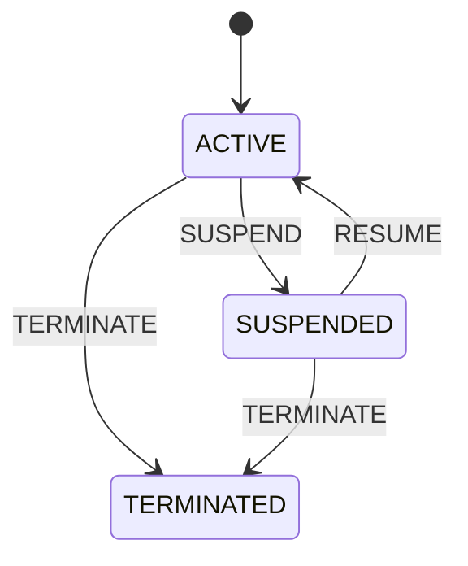
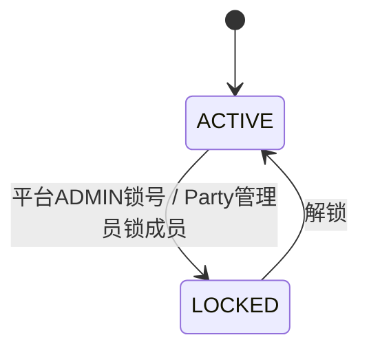
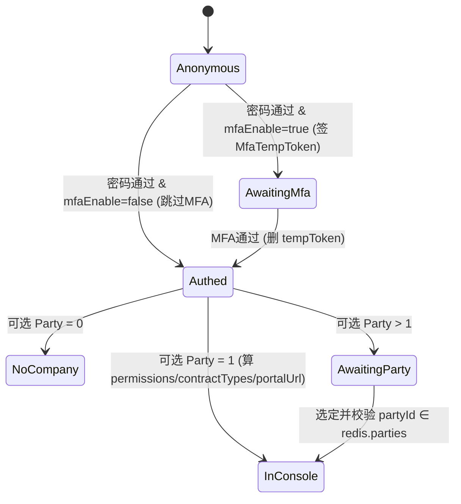

# Domain — portal（登录入口 / 选择 Party）

> 词汇与约束以 `/Users/tymon/11-git/pep-schema/postgresql/schema.sql`（PostgreSQL，`sys_*` 10 表）+ 数据模型文档为准；`api-spec.md` 的 schema 与 `logic.md` 的规则复用这里的命名。字段名用 camelCase（映射 DB snake_case）。本区域覆盖 Party/Contract/Role/User/MFA/Invite/Notice/OperationLog；portal 自身只用到登录相关子集（Party/PartyContract/Role/User/MfaInfo/PartyUser/OperatorInvite），其余实体作为区域共享词汇列出。代码现状与本规格的差距见 `gap-analysis.md`。

## Entities

### Party / 契约 / 事件

| Entity | Field | Description |
| --- | --- | --- |
| `Party`（sys_party） | `partyId` | 主体主键 |
|  | `partyName` | 名称，**唯一**，必填 |
|  | `country` | ISO 3166 国家码，必填 |
|  | `address` / `contactName` | 可选 |
|  | `email` | citext（大小写不敏感），可选 |
|  | `phoneCountryCode` / `phone` | 区号 + 号码，可选 |
|  | `timezone` | IANA 时区（如 `Asia/Shanghai`），必填；用于把契约/角色的 DATE 解读为 UTC |
|  | `license` | 可选 |
|  | `status` | `PartyStatus`：`ONBOARDING`（刚建、未绑管理员）/ `ACTIVE`（首个管理员绑定后）；状态机见 Lifecycles |
|  | `remark` | 可选 |
| `PartyContract`（sys_party_contract） | `partyContractId` | 契约主键 |
|  | `authorizedPartyId` | 被授权方（契约主体） |
|  | `authorizedContractType` | `ContractType` 枚举（7 值，代码写死） |
|  | `authorizedTimestamp` | 授权时间，可空 |
|  | `authorizingPartyId` | 授权方；MERCHANT 时指向拥有该 MERCHANT 的 Party |
|  | `authorizingPartyContractType` | 冗余：授权方契约类型，便于判断业务来源 |
|  | `effectiveFromDate` / `effectiveToDate` | DATE；结合 `Party.timezone` 解读为「当天 00:00:00 / 当天最后一秒」的 UTC；`toDate` 空 = 不限期 |
|  | `terminatedByPartyId` / `terminatedAt` | 终止方与终止时间；与 `status=TERMINATED` 一致（见 Invariants） |
|  | `status` | `ContractStatus`：`ACTIVE` / `SUSPENDED` / `TERMINATED`；状态机见 Lifecycles |
|  | `entitlements` | JSONB；按 `contractType` 不同载荷不同（见下「Entitlements」） |
|  | `logos` | JSONB：`{platformLogo:[], appBootLogo:{}}`；`appBootLogo` 仅 US-ISO/US-ISO-PILOT/US-ISV/US-ISV-PILOT 生效 |
| `PartyContractEvent`（sys_party_contract_event） | `partyContractEventId` | UUID 主键 |
|  | `partyContractId` | 所属契约（级联删除） |
|  | `eventType` | `ContractEventType` 枚举（7 值，含 `PILOT_CONVERT_ACTIVE`） |
|  | `payload` | JSONB；按 `eventType` 不同（见下「Event payload」） |
|  | `eventTimestamp` | 必填 |
|  | `operatorUserId` | 操作人，必填 |
|  | `operatorUserName` | 冗余操作人名，避免展示 timeline 时 JOIN |

### 用户 / MFA / 归属 / 邀请

| Entity | Field | Description |
| --- | --- | --- |
| `User`（sys_user） | `userId` | 用户主键 |
|  | `nickName` | 必填 |
|  | `email` | citext，**唯一**，必填——**登录标识** |
|  | `passwordHash` | argon2id（含 salt），必填 |
|  | `passwordChangedTimestamp` | 上次改密时间 |
|  | `passwordErrorTimes` | 连续失败次数，默认 0；仅登录成功清零（见 Invariants） |
|  | `passwordErrorLockExpiredTimestamp` | 刷错锁到期；空=未锁；判定只看时间戳 |
|  | `country` / `phoneCountryCode` / `phone` | 可选 |
|  | `mfaEnable` | 默认 false；true 时登录走 MFA 分岔 |
|  | `status` | `UserStatus`：`ACTIVE` / `LOCKED`（仅平台 ADMIN 可锁）；状态机见 Lifecycles |
|  | `lastLoginAt` | 最近登录成功时间 |
|  | `passwordHistory` | JSONB `List<{passwordHash}>`，应用层最多留 **5** 条 |
| `MfaInfo`（sys_mfa_info） | `mfaInfoId` | 因子主键 |
|  | `userId` | 所属用户（级联删除） |
|  | `mfaType` | 固定 `TOTP` |
|  | `secretEncrypted` | 加密存储的 TOTP 种子（DB_PROTECT_KEY 解密） |
|  | `failTimes` | 失败次数；**MFA 唯一权威计数器**；成功 / 锁过期清零 |
|  | `lastFailTimestamp` | 最近失败时间，算锁窗 |
|  | `status` | `MfaStatus`：`ACTIVE` / `PENDING`；一个用户可多条 |
| `PartyUser`（sys_party_user） | `partyUserId` | 归属主键 |
|  | `partyId` / `userId` | 用户在某 Party 下的归属；`(partyId,userId)` **唯一** |
|  | `roles` | JSONB `List<{roleId}>`（已批准例外） |
|  | `authorizingType` | `AuthorizingType`：`ADMIN`（拥有所有权限，首个被邀请者，**不可删除**）/ `NORMAL`（按 role 配置） |
|  | `authorizingTimestamp` / `authorizingUserId` / `authorizingUserName` | 授权审计 |
|  | `status` | `MembershipStatus`：`ACTIVE` / `LOCKED`（各 Party 管理员只能操作此处；User 状态归平台 ADMIN） |
|  | `authorizingFrom` / `authorizingTo` | 授权时间窗（空=无界）；`authorizingTo < now()` 即 Expired |
|  | `remark` | Party 管理员对用户的备注 |
| `OperatorInvite`（sys_operator_invite） | `operatorInviteId` | 邀请主键 |
|  | `partyId` | 被邀请入驻的主体 |
|  | `inviterPartyId` / `inviterUserId` | 邀请者所属主体 / 邀请者 |
|  | `inviteEmail` | citext，必填 |
|  | `token` | **全局唯一**，有效期 7 天 |
|  | `intendedRole` | JSONB `List<{roleId}>`，入驻后初始角色 |
|  | `expiresAt` / `consumedAt` | 超时 / 使用时间 |
|  | `resendCount` | 重发次数，默认 0 |
|  | `status` | `InviteStatus`：`PENDING` / `CONSUMED`；过期由 `expiresAt<now()` 计算（见 Invariants） |

### 角色 / 站内信 / 操作日志

| Entity | Field | Description |
| --- | --- | --- |
| `Role`（sys_role） | `roleId` | 角色主键。区间约定：1–100 admin / 101–200 customer / 201–300 merchant 预留（均**死写代码、不入库**）；DB IDENTITY 从 **1001** 起，仅动态 PRIVATE |
|  | `roleName` | 必填 |
|  | `roleType` | `RoleType`：`GLOBAL`（通用，死写代码、不入库，`partyId` 空）/ `PRIVATE`（指定，ADMIN 动态创建、落库，`partyId` 指向 customer） |
|  | `partyId` | PRIVATE 角色归属的 Party |
|  | `startDate` / `endDate` | DATE；结合 `Party.timezone` 解读为 UTC「当天 0 秒 / 最后一秒」；`endDate` 空=无限期 |
|  | `permissionCodes` | JSONB `List<String>`（已批准例外）；按某 permission code 反查角色清单（GIN） |
| `Notice`（sys_notice） | `noticeId` | UUID 主键 |
|  | `userId` | 接收用户 |
|  | `belongToPartyId` | 所属 Party，可空 |
|  | `noticeType` | 字符串（`TICKET` / `NEW APP VERSION` / `APP SUBSCRIPTION`） |
|  | `title` | 标题 |
|  | `payload` | JSONB，**必含 `content`**；按 type 不同附加字段 |
|  | `status` | `NoticeStatus`：`UNREAD` / `READ` |
| `OperationLog`（sys_operation_log） | `operationLogId` | UUID 主键；只写不改 |
|  | `traceId` | 请求链路 ID |
|  | `operatorUserId` | 操作人，可空（系统触发） |
|  | `operatorNickName` | 冗余操作人名，防改名失真 |
|  | `operatorIp` | 来源 IP |
|  | `partyId` | 操作人所属主体 |
|  | `action` | 操作动作（可复用 permission code） |
|  | `title` / `detail` | 一句话摘要 / JSONB 上下文 |
|  | `result` | `LogResult`：`SUCCESS` / `FAILURE` |
|  | `failureReason` | 失败原因 |

### Entitlements（PartyContract.entitlements JSONB，按 contractType 分支）
> 价格类完整目录见数据模型源文档；这里给结构与**跨字段约束**（落到 Invariants）：
- `US-ISO`：settlementCurrency、deviceBasicService、Payment Service(apps[])、FlyDesk、GeoLocation、GeoFencing、Pre-warning、Merchant Portal、Portal Service；各服务 `{enable, price}`，`enable=true` 时 price 必填（0=免费）。
- `US-ISO-PILOT`：settlementCurrency + FlyDesk/GeoLocation/GeoFencing/Pre-warning（仅 `enable`，试用全免费，无 price）。
- `MERCHANT`：settlementCurrency、Payment Service(appItem[] 的 `pkgName` **只能取上游 ISO 授权过的**)、E-Receipt Service(options: EMAIL/QR CODE)。
- `PLATFORM-CUSTOM`：logos（platformLogo[] / appBootLogo）。
- （US-ISV / US-ISV-PILOT 同构于 ISO/ISO-PILOT。）

### Event payload（PartyContractEvent.payload，按 eventType）
`CREATE_CONTRACT{entitlementsSnapshot}`、`EDIT_CONTRACT{fromEntitlements,toEntitlements,reason?}`、`RENEW{fromEndDate,toEndDate,reason?}`、`SUSPEND{reason}`、`RESUME{reason}`、`TERMINATE{reason}`、`PILOT_CONVERT_ACTIVE{...}`。

### 非持久化领域概念（会话与票据）
- `LoginChallenge` — `GET /auth/login-challenge` 下发 `{serverTimestamp, nonce}`；nonce 存 Redis `AUTH:LOGIN-NONCE:{nonce}`（TTL 130s），登录时 `GETDEL` 单次消费（防重放）。
- `MfaTempToken` — 密码通过且 `mfaEnable=true` 时签发，Redis `AUTH:MFA:USER-{tempToken}={userId}`（TTL 300s），MFA 通过后删除（一次性）。
- `Session`（pep-token） — 正式会话，Redis `AUTH:USER-TOKEN:{token}`，cookie 名 **`pep-token`**；含 `{userId,email,nickName,mfaPassed}` + 选定后追加 `parties[]` / `party{permissions,contractTypes,portalUrl}`。
- `PartialSession` — 已建 pep-token 但未选 Party 的中间态；无 `party.permissions`，**只能调「选 Party」**。

## Relationships
- `Party` 1—* `PartyContract`（经 `authorizedPartyId`）；MERCHANT 契约经 `authorizingPartyId` 指向其拥有方 Party。
- `Party` 1—* `PartyUser` *—1 `User`（用户经归属属于多个 Party）。
- `User` 1—* `MfaInfo`（可多条，稳态至多 1 条 ACTIVE）。
- `Role` 经 `PartyUser.roles`（JSONB）被引用；GLOBAL 角色全局、PRIVATE 角色限 `partyId`。**无角色黑名单表**。
- `PartyContract` 1—* `PartyContractEvent`。

## Enums
> DB 层均为 `VARCHAR + CHECK`，非 PG ENUM。
- `PartyStatus = ONBOARDING | ACTIVE`
- `ContractType = ADMIN | US-ISO | US-ISV | US-ISO-PILOT | US-ISV-PILOT | MERCHANT | PLATFORM-CUSTOM`
- `ContractStatus = ACTIVE | SUSPENDED | TERMINATED`
- `ContractEventType = CREATE_CONTRACT | EDIT_CONTRACT | RENEW | SUSPEND | RESUME | TERMINATE | PILOT_CONVERT_ACTIVE`
- `RoleType = GLOBAL | PRIVATE`
- `UserStatus = ACTIVE | LOCKED`
- `MfaType = TOTP` ；`MfaStatus = ACTIVE | PENDING`
- `AuthorizingType = ADMIN | NORMAL` ；`MembershipStatus = ACTIVE | LOCKED`
- `InviteStatus = PENDING | CONSUMED`
- `NoticeStatus = UNREAD | READ` ；`LogResult = SUCCESS | FAILURE`

## Roles（登录链路行为主体）
### 匿名访客（Anonymous）
- 未登录；可取 login-challenge、发起密码登录、走邀请入驻流程。

### 已登录待选 Party（PartialAuthenticated）
- 持 `pep-token` 但未选定 Party；**只能调「选 Party」**，访问不了业务 API。
- 可选范围：自己 `MembershipStatus=ACTIVE` 且授权窗有效、且 `party.status != ONBOARDING` 的 Party（合同有效性**不**作门禁，见 Invariants）。

### 已完整登录（Authenticated）
- `pep-token` 已含 `party{permissions,contractTypes,portalUrl}`；按 portalUrl 进入对应控制台。
- `AuthorizingType=ADMIN` → 该 Party 全权限；`NORMAL` → `role.permissionCodes` ∩ 当前契约点亮的菜单作用域。

## Lifecycles
### `Party.status`

### `PartyContract.status`

### `User.status` / `MembershipStatus`

### `MfaInfo.status`：`[*] --> PENDING --> ACTIVE`（激活成功转 ACTIVE）。
### `InviteStatus`：`[*] --> PENDING --> CONSUMED`（过期不改状态，由 `expiresAt<now` 计算）。
### 登录会话推进

## Invariants
- **登录按 email、不存在与密码错归一**：`email` 唯一；查不到用户与密码错误返回同一「账号或密码错误」，防枚举。
- **密码**：argon2id；明文 12–18 位且含大写/小写/数字/符号（应用层）；`passwordHistory` 最多 5 条、改密不得复用。
- **刷错锁只看时间**：`passwordErrorLockExpiredTimestamp` 在未来即锁定；达 `LOGIN_ERROR_TIMES=6` 置锁 `+LOGIN_LOCK_WINDOW_MINUTE=60min`；**锁过期不自动清零**（解锁后再错一次立即重锁）；仅登录成功清零。
- **登录防重放**：密文内含服务端 nonce，`|now - timestamp| <= 120s`（双向）且 nonce 必须可被 `GETDEL` 单次消费。
- **MFA 计数唯一权威 = `MfaInfo.failTimes`**（无 Redis 计数器）；`failTimes>=10 && now-lastFailTimestamp<60min` 锁定；锁过期清零再校验；成功清零。多 ACTIVE 因子**轮询**，任一通过即过。TOTP `step=60`。
- **MFA 一致性**：`mfaEnable` 与因子 `ACTIVE/作废`必须同一事务、单一写入口翻转（开通/禁用/换绑/管理员重置）。
- **选 Party 门禁线 = 成员/账号状态**（`MembershipStatus=ACTIVE` + 授权窗有效 + `party.status!=ONBOARDING`）；**合同有效性不作门禁**——过期/SUSPENDED 仍可登录，但 `permissions=[]`/`contractTypes=[]`，须配「合同过期/暂停」落地页。
- **权限计算（role 与 contract 解耦）**：契约门控只在**菜单层**（`menu.contractTypes`）。有效权限 = `Role.permissionCodes` ∩ 当前契约点亮的菜单作用域，叠加 `Role.startDate/endDate` 时间窗；GLOBAL 全局可用、PRIVATE 限本 Party；**role 不带 contractType、无黑名单、无 `*` 通配**。`AuthorizingType=ADMIN` 直接拿作用域全部。
- **角色来源分流**：GLOBAL（roleId ≤ 300）死写代码、不入库；PRIVATE（≥ 1001）落 DB `sys_role`；会话按 roleId 分流解析后合并。
- **契约唯一性**：非 TERMINATED 下 `(authorizedPartyId, authorizedContractType, authorizingPartyId)` 唯一；全局至多一个非 TERMINATED 的 `ADMIN` 契约（创建客户主体时不可选 ADMIN）。
- **契约终止一致性**：`status=TERMINATED ⇔ terminatedAt 非空`；`effectiveFromDate <= effectiveToDate`（若都非空）。
- **PILOT 转正不可逆**：`US-ISO-PILOT → US-ISO` 须先停 PILOT 再开正式，之后不可回退；先开正式则不允许再开 PILOT（ISV 同理）。
- **MERCHANT 归属**：MERCHANT 契约的 `authorizingPartyId` 必须拥有 US-ISO/US-ISO-PILOT 身份；其支付 `pkgName` 只能取上游 ISO 授权过的。
- **GeoFencing 依赖 GeoLocation**：未开 GeoLocation 不能开 GeoFencing。
- **首个管理员不可删**：每个 Party 第一个被邀请的 `AuthorizingType=ADMIN` 成员是主账号，不允许删除。
- **邀请可用性**：可用 = `status=PENDING && expiresAt>=now()`；过期 = `status=PENDING && expiresAt<now()`；token 全局唯一、7 天有效；`status=CONSUMED ⇔ consumedAt 非空`。
- **JSONB 关联例外**：`PartyUser.roles` / `Role.permissionCodes` / `OperatorInvite.intendedRole` 刻意用 JSONB 数组（项目已批准例外）。

## Cross-cutting rules
- **审计**：状态变更类操作写 `OperationLog`（who/what/when/result，trace 关联）；契约变更额外写 `PartyContractEvent`。
- **时间**：DATE 字段一律结合 `Party.timezone` 解读为 UTC 边界（起始日 0 秒 / 结束日最后一秒）；时间戳 `TIMESTAMP(3)` 毫秒，对齐 JS Date。
- **会话载体**：cookie `pep-token` + Redis；未选 Party 的中间态无业务权限。
